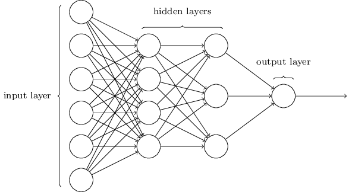

# Natural Language Processing Advancements By Deep Learning: A Survey - Summary
> "Generally AI is anything a computer can do that formerly was considered a job for a human"

## II. Background

### A. Artificial Intelligence and Deep Learning

#### Definitions
- Deep Learning: Applying massive amounts of data to deep neural networks for it to learn how to handle a task.
- Feed-Forward Neural Network: A neural network in which the connections between nodes do not create any cycle, i.e., information flows in one direction.
- Bag-of-words (BoW): A method of representing textual data by word and frequency. BoW ignores the order and interaction of words, and treats each word as a unique feature. 
- Benchmarking: The assessment of methods and algorithms to compare their capability to learn specific patterns. 

#### Deep Learning Architectures
1. Multi Layer Perceptron (MLP)

	A MLP has at least 3 layers: input, hidden, output. A layer is a collection of neurons which are nodes that transform information. Each neuron in a layer connects to all neurons in the next layer. However, neurons within each layer **do not** communicate with each other. MLPs are a class of FNNs.

2. Convolutional Neural Network (CNN)

	A CNN is a class of FNNs inspired by the human visual cortex. CNNs are used in situations where data is represented as 2D or 3D data maps. CNNs take in an image represented as an array of values and use convolution to preform feature extraction by determining the relationship of a pixel to neighboring pixels. Convolutional layers have 3 dimension (width, height, depth) and are most commonly used in computer vision.

3. Recurrent Neural Networks (RNN)

	A RNN is a sequence of FNNs with each output fed to the input of the next FNN. Hidden layers in the RNN carry information from the past (memory) making it suited to handle a sequence of inputs common in language modeling. Long Short Term Memory Networks (LSTM) are the most common class of RNNs used to try to capture long time dependencies of inputs from different time steps.

	Ex. Consider the sentence: "Michael Jackson was a singer; some people consider him King of Pop." It's easy for a human to identify *him* as referring to Michael Jackson. The pronoun *him* happens seven words after *Michael Jackson*

4. Autoencoders

	Autoencoders consist of an encoder and a decoder. An encoder is similar to a FNN in that it encods an input into a vector. A decoder constructs an output based on the vector produced by the encoder. The goal of the autoencoder is to generate an approximate reconstruction of the output which is why it is used in unsupervised learning. 

5. Generative Adversarial Networks (GAN)

	A GAN consists of a discriminator neural network and a generator neural network. First the generator generates a fake sample. Then the discriminator tries to determine if the sample was generated or from the training data. This iterative process continues until the generator can produce samples that the discriminator cannot distinguish from the training data. In NLP, GANs are often used in text generation. 

### B. Motivations for Deep Learning in NLP

Currently, most NLP tasks rely on annotated data. Because of the abundance of unlabeled data, unsupervised feature learning is considered a crucial tasks in the progression of NLP.

## III. Core Concepts in NLP

### A. Feature Representation
1. One-Hot Representation
	
	Each unique element has its own dimension which leads to a high dimensional and sparse representation space. This structure allows for no connection between words.

	Ex. Highly correlated words such as 'ocean' and 'water' will not be closer to each other compared to less correlated pairs such as 'ocean' and 'fire'

2. Continuous Bag of Words (CBOW)

	Tries to predict a word given a few surrounding words as context. Like BoW, CBOW does not consider the order of words.

3. Word-Level Embedding

	Semantically correlated words become more probabalistic in the representation space.

4. Character-Level Embedding 
	
	Instead of a representation space of words, character embedding utilizes a vocabulary of characters to represent text. This type of embedding is useful when encountering out-of-vocabulary words (OOV) which are words that have no equivalent word in the representation space. 

### B. Seq2Seq Framework
	
	Both input and output are represented as a sequence and most commonly made of an encoder and decoder. The encoder takes a sequence of data as the input and generates a mid-level output. The decoder takes in the output and generates a sequence of outputs. The seq2seq models are common in translation, summarization, and speech-to-text/text-to-speech. 

	Teacher Forcing is a common training approach for seq2seq models where the output generated by the decoder is compared to the ground truth to adjust the weights. The output is compared using the cross-entropy (CE) loss minimization function which calculates the difference from the ground truth and the output and adjusts the weights to minimize the difference. 

### C. Reinforcement Learning in NLP

	Seq2seq has issues with exposure bias and inconsistency between training time and test time measurements. During training, the decoder of seq2seq models use the previous decoder output and the ground truth as the input however, during test time, the ground truth data is unavailable. Therefore, the input of the decoder during testing relies on the previous prediction. This exposure bias induces error growth. 

	One approach to solve this problem is to remove the ground-truth dependency during training and solely rely on cross-entropy loss. Then, we can use scheduled sampling to slowly replace the ground truth with samples the model generates. 

## IV. Datasets

	The effectiveness of a model depends on the quality of the data. For example, BERT is a successful language model however, in order to be effective at a certain task, the model needs to be trained on data associated with that task. 

	Datasets are split into training data and testing data. Training data is for training the model in creating connections between inputs and outputs. Testing data is for assessing the performance of the model. 

## V. Deep Learning for NLP Tasks

### A. Basic Tasks

1. Part-Of-Speech (POS) tagging

	POS tagging is one of the basic tasks in NLP. It is the process of labeling words with their part of speech categories. 

2. Parsing
	
	Parsing is assigning a structure to a string. 

	*Constituency Parsing* is when we assign a syntactical structure to a sentence. 

	*Dependency Parsing* is when we show the structural relationship between words in a sentence. 

3. Semantic Role Labeling (SRL)

	SRL is the identification and classification of text arguments. It identifies the predicate-argument structure of a sentence. The predicate refers to the "what," while the arguments consist of the associated participants and properties in the text. The goal of SRL is to extract the semantic relations between the predicate and the related arguments.

### B. Text Classification

	Text classification is the assignment of text to predefined categories.

### C. Information Extraction

	Identifying structured information from unstructured data.

1. Named Entity Recognition (NER)

	Locates and categorizes entities into pre-defined categories of names such as names of people and places.

2. Relation Extraction

	Finds semantic relationships between entity pairs. 

3. Coreference Resolution

	Identifies text in a context that refer to the same entity. For instance, the mentions "car", "Camry," and "it" could all refer to the same entity. 

4. Event Extraction

	Extracting specific information from text after a trigger such as a trigger word. 

### D. Sentiment Analysis

	The goal of sentiment analysis is to extract subjective information (opinion/sentiment) from text by contextual mining.

1. Document-level Sentiment Analysis

	Determines whether the whole document reflects a positive or negative sentiment.

2. Sentence-level Sentiment Analysis
	
	Determines whether the opinion expressed in a sentence is positive, negative, or neutral.

3. Aspect-level Sentiment Analysis

	Determines the sentiment of a particular target. Aspect-level sentiment analysis involves *Aspect Sentiment Classification* (opinion on different aspects) and *Aspect Extraction* (identifies the target aspect for evaluation).

	Ex. "This car is old. It must be repaired and sold!". "This car" is what is subject to evaluation and must be extracted first. Here, the opinion about this aspect is negative.

### E. Machine Translation

	

